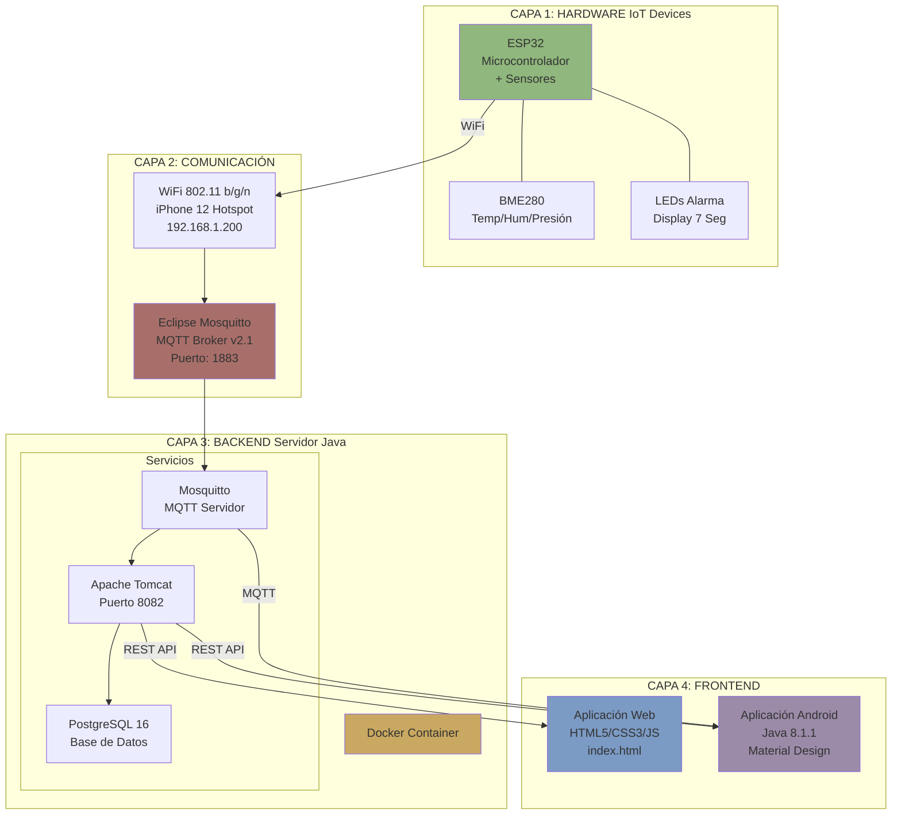
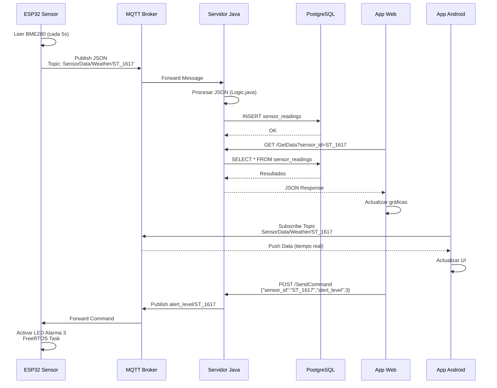
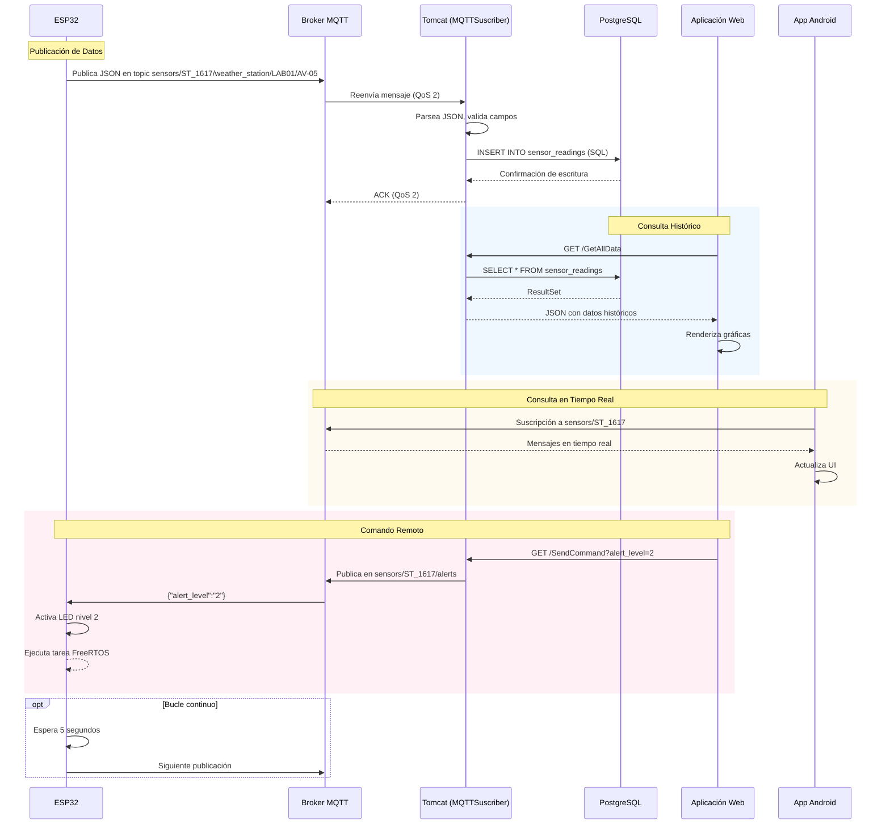
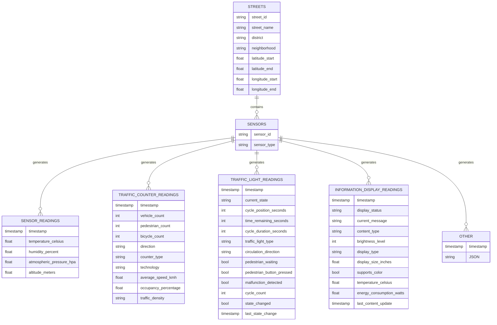
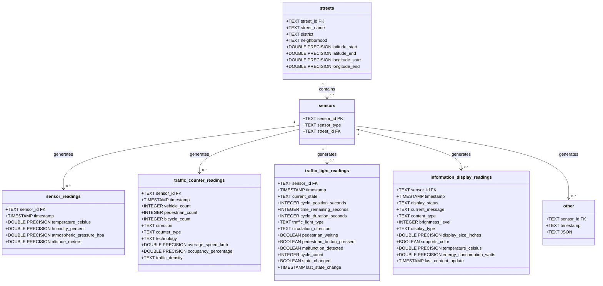
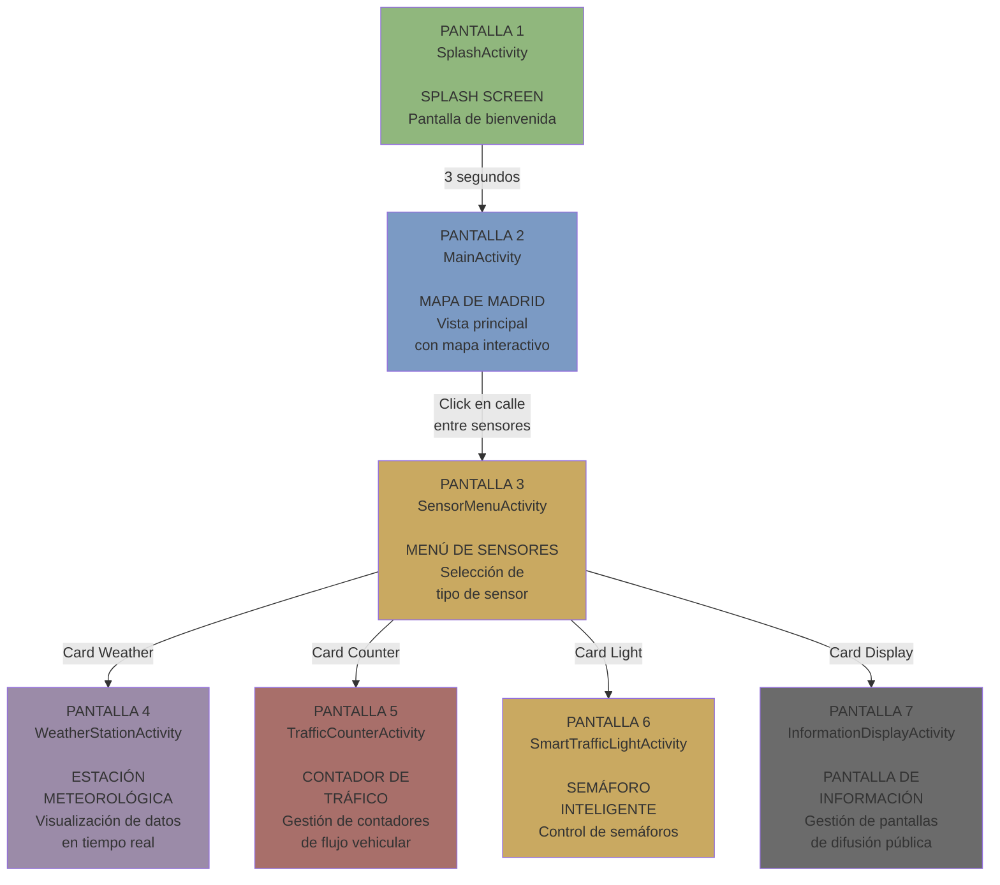
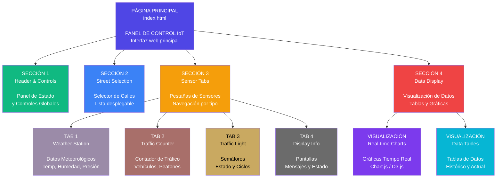

# Arquitectura del Sistema IoT Smart City

## Vista General del Sistema



## Arquitectura por Capas

### **CAPA 1: HARDWARE (IoT Devices)**

#### Componentes Hardware
- **ESP32 (BME280)**
  - Temperatura (-40°C a 85°C)
  - Humedad (0-100%)
  - Presión (300-1100 hPa)
  - Altitud (calculada)
  
- **Conexiones I2C:**
  - BME280 SDA → GPIO 21 (Pull-up 4.7kΩ)
  - BME280 SCL → GPIO 22 (Pull-up 4.7kΩ)
  - Dirección I2C: 0x76

- **LEDs y Display:**
  - LED Rojo (GPIO 12) - Alerta local
  - LED Alarma 1-3 (GPIO 4, 5, 13)
  - Display 7 segmentos (GPIO 14, 18, 19, 23, 25, 26, 27)

#### Software Embebido
- **ComputacionUbicua.ino** - Programa principal
- **ESP32_UTILS.hpp** - Gestión WiFi
- **ESP32_Utils_MQTT.hpp** - Cliente MQTT + FreeRTOS
- **config.h** - Configuración del sistema

#### Flujo de Operación
```
1. Inicialización → Configurar GPIO
2. Conectar WiFi → 172.20.10.11
3. Conectar MQTT → Broker
4. Ciclo cada 5s → Leer sensores
5. Publicar datos → Topic MQTT
6. Escuchar comandos → Control remoto
```

---

### **CAPA 2: COMUNICACIÓN**

#### Protocolos
- **WiFi 802.11 b/g/n**
  - SSID: iPhone 12
  - Password: 12345678
  - IP ESP32: 172.20.10.11
  - Gateway: 172.20.10.1
  - Subnet: 255.255.255.0

- **MQTT (Message Queuing Telemetry Transport)**
  - Broker: Eclipse Mosquitto v2.1
  - Puerto: 1883 (inseguro)
  - QoS: 0, 1, 2
  - Retain: false
  - Keepalive: 60 seg

#### Topics MQTT
```
Publicación ESP32:
→ SensorData/Weather/{sensor_id}
→ SensorData/TrafficCounter/{sensor_id}
→ SensorData/TrafficLight/{sensor_id}
→ SensorData/InformationDisplay/{sensor_id}

Suscripción ESP32:
← SensorCommand/{sensor_id}
← alert_level/{sensor_id}
```

---

### **CAPA 3: BACKEND (Servidor Java)**

#### Docker Container
```yaml
Services:
  - postgres:16
  - tomcat:latest  
  - eclipse-mosquitto:2.0
```

#### Capa de Lógica
**Paquete: Logic/**
- `Logic.java` - Lógica de negocio principal
- `Measurement.java` - Clase base de mediciones
- `TrafficCounterMeasurement.java`
- `TrafficLightMeasurement.java`
- `InformationDisplayMeasurement.java`
- `Projectinitializer.java` - Inicialización JPA
- `Log.java` - Sistema de logging

#### Capa de Datos
**Paquete: Database/**
- `ConectionDDBB.java` - JPA EntityManager
- `Topics.java` - Gestión de topics MQTT
- PostgreSQL 16 con 7 tablas:
  - streets
  - sensors
  - sensor_readings
  - traffic_counter_readings
  - traffic_light_readings
  - information_display_readings
  - other

#### Capa de Comunicación
**Paquete: Mqtt/**
- `MQTTBroker.java` - Configuración broker
- `MQTTSuscriber.java` - Suscriptor a topics
- `MQTTPublisher.java` - Publicador de mensajes

#### Capa de Servlets (REST API)
**Paquete: Servlets/**
- `GetStreets.java` - GET calles
- `GetSensors.java` - GET sensores por calle
- `GetData.java` - GET datos de sensor
- `GetAllData.java` - GET todos los datos
- `SetData.java` - POST insertar lecturas
- `PublishMQTT.java` - POST publicar MQTT
- `SendCommand.java` - POST enviar comando
- `SystemStatus.java` - GET estado del sistema

---

### **CAPA 4: FRONTEND (Aplicaciones)**

#### Aplicación Web
**Tecnologías:**
- HTML5, CSS3, JavaScript (ES6+)
- jQuery 3.4.1
- Font Awesome 6.4.0
- Chart.js (gráficas)
- AJAX (comunicación asíncrona)

**Estructura:**
- index.html (SPA - Single Page Application)
- Secciones:
  1. Header & Controls
  2. Street Selection
  3. Sensor Tabs (4 tipos)
  4. Data Display (tablas + gráficas)

**Comunicación:**
- REST API → Solicitudes HTTP GET/POST
- MQTT (opcional) → WebSockets para tiempo real

#### Aplicación Android
**Tecnologías:**
- Java 8.1.1
- Android SDK 33 (Tiramisu)
- Material Design 1.10.0
- OSMDroid (mapas)
- MPAndroidChart (gráficas)
- Eclipse Paho MQTT

**Arquitectura:**
- 7 Activities (pantallas)
- Patrón MVC implícito
- Cliente MQTT integrado
- Navegación por Intent

**Funcionalidades:**
- Visualización en mapa Madrid (OSM)
- Datos en tiempo real vía MQTT
- Gráficas interactivas
- Gestión de sensores por calle
- Control remoto de dispositivos

---

## Flujo de Datos Completo



## Diagrama de Secuencia Detallado



## Protocolos y Formatos

### Formato JSON - Sensor Weather
```json
{
  "sensor_id": "ST_1617",
  "sensor_type": "weather",
  "timestamp": "2026-01-02T15:30:45Z",
  "temperature_celsius": 22.5,
  "humidity_percent": 65.3,
  "atmospheric_pressure_hpa": 1013.25,
  "altitude_meters": 667.8,
  "street_id": "CALLE_001",
  "location": {
    "latitude": 40.4637,
    "longitude": -3.6887,
    "district": "Hortaleza",
    "neighborhood": "Pepe Hillo"
  }
}
```

### Comandos MQTT
```
Topic: SensorCommand/ST_1617
Payload: {"command":"set_alert","level":3}

Topic: alert_level/ST_1617  
Payload: 3
```

## Interacción y Tiempos

| Acción | Tiempo | Protocolo |
|--------|--------|-----------|
| Lectura sensor | 5 segundos | I2C |
| Publicación MQTT | Inmediato | MQTT QoS 1 |
| Procesamiento servidor | < 100 ms | Java |
| Inserción BD | < 50 ms | SQL |
| Respuesta REST API | < 200 ms | HTTP |
| Actualización Web | 1-5 segundos | AJAX |
| Actualización Android | Tiempo real | MQTT Push |

## Análisis

### Fortalezas
✅ Arquitectura desacoplada (capas independientes)  
✅ Comunicación asíncrona (MQTT)  
✅ Escalabilidad horizontal (Docker)  
✅ Multiplataforma (Web + Android)  
✅ Tiempo real (MQTT push)  
✅ Persistencia de datos (PostgreSQL)  

### Limitaciones
⚠️ MQTT sin TLS (inseguro)  
⚠️ Autenticación básica  
⚠️ Sin balanceador de carga  
⚠️ Dependencia de WiFi  
⚠️ Sin redundancia de broker  

---

## Diagrama Entidad-Relación



## Diagrama de Tablas



## Diagrama de Pantallas - Aplicación Android



### Detalle de Componentes por Pantalla

#### **PANTALLA 1 - SplashActivity**
- **Componentes:**
  - Logo de la aplicación
  - Texto de bienvenida
- **Funcionalidad:**
  - Mostrar durante 3 segundos
  - Transición automática a MainActivity
- **Layout:** `activity_main.xml`
- **API:** GeoDataes, GeoDataos

#### **PANTALLA 2 - MainActivity**
- **Componentes:**
  - Mapa OpenStreetMap (OSMDroid)
  - Marcadores de calles con sensores
  - Tooltips estado de conexión
  - Marcadores de cada calle
- **Funcionalidad:**
  - Cargar calles desde servidor (GetStreets)
  - Mostrar marcadores en el mapa
  - Mostrar marcadores con info de sensores
  - Centrado en Madrid (lat: 4.095, -3.628)
- **Layout:** `activity_map.xml`
- **API:** GetStreets, GetSensors

#### **PANTALLA 3 - SensorMenuActivity**
- **Componentes:**
  - 4 CardView para botones
  - Título con nombre de calle
  - Botón back (opcional)
  - Imágenes/Iconos visibles
- **Funcionalidad:**
  - Recibe datos de calle seleccionada
  - Muestra solo sensores disponibles
  - Navega a activities específicas
  - Devuelve calle sin sensores
- **Layout:** `activity_sensor_menu.xml`
- **API:** SensorDataActivity.java

#### **PANTALLA 4 - WeatherStationActivity**
- **Componentes:**
  - TextView ID sensor (oculto)
  - TextView humedad
  - TextView temperatura atmosférica
  - TextView altitud
  - TextView temperatura (grande)
  - LineChart (temperatura y humedad)
  - LineChart (presión como rango (n-4))
  - TextView estado conexión
  - ImageView estado conexión
- **Funcionalidad:**
  - Suscripción MQTT en tiempo real
  - Gráficas interactivas (MPAndroidChart)
  - Actualización automática
  - Gestión estado WIFI/3G
  - Botones actualizar datos (pull refresh)
  - Historial últimos 30 datos
- **Layout:** `activity_weather_station.xml`
- **API:** WeatherDataActivity.java, MPAndroidChart_API
- **MQTT:** SensorDataWeather_Activity_SensorType_ID

#### **PANTALLA 5 - TrafficCounterActivity**
- **Componentes:**
  - TextView ID sensor (oculto)
  - TextView conteo vehicular
  - TextView conteo peatonal
  - TextView conteo ciclistas
  - TextView dirección flujo
  - TextView tecnología
  - TextView densidad tráfico
  - BarChart visualización
- **Funcionalidad:**
  - Suscripción MQTT en tiempo real
  - Gráfica de barras comparativa
  - Indicadores visuales
- **Layout:** `activity_traffic_counter_data.xml`
- **API:** TrafficCounterDataActivity.java
- **MQTT:** SensorDataTrafficCounter_ActivityType_ID

#### **PANTALLA 6 - SmartTrafficLightActivity**
- **Componentes:**
  - TextView ID sensor (oculto)
  - TextView estado actual (color grande)
  - TextView posición de ciclo (segundos)
  - TextView tiempo restante
  - TextView duración completa
  - ImageView estado visual (rojo/verde/amarillo)
  - TextView dirección circulación
  - TextView detección peatón (sí/no)
  - TextView tiempo wait sensor
  - ImageView state direction
  - TextView/Botones espera peatón
  - ImageView visor
- **Funcionalidad:**
  - Actualización de estado en tiempo real
  - Cambio color según estado actual
  - Manejo conteos (sólo semáforos)
  - Contador cíclico semáforo
  - ImageView visor
- **Layout:** `activity_traffic_count_state.xml`
- **API:** TrafficLightDataActivity.java
- **MQTT:** SensorDataTraffic_Activity_SensorType_ID

#### **PANTALLA 7 - InformationDisplayActivity**
- **Componentes:**
  - TextView ID sensor (oculto)
  - TextView mensaje actual
  - TextView estado
  - TextView brillo
  - TextView temperatura display
  - TextView consumo energético (kWh)
  - TextView última actualización
  - TextView soporte color (sí/no)
  - TextView/Line
- **Funcionalidad:**
  - Suscripción MQTT en tiempo real
  - Estado de pantalla (on/off)
  - Monitoreo estado en tiempo (operativa)
  - Control de título y mensaje/datos
  - Control con estado de dispositivo público
- **Layout:** `activity_display_state.xml`
- **API:** InformationDisplayActivity.java
- **MQTT:** SensorDataInformationDisplay_ActivitySensor_ID

---

## Diagrama de Pantallas - Aplicación Web



### Detalle de Componentes de la Aplicación Web

#### **PÁGINA PRINCIPAL - index.html**

##### **SECCIÓN 1: Header & Controls**
- **Componentes:**
  - Logo y título de la aplicación
  - Indicador de estado del servidor
  - Botón de actualización manual
  - Controles de configuración
  - Estado de conexión MQTT
- **Funcionalidad:**
  - Monitoreo de estado del sistema
  - Control de actualización de datos
  - Configuración de intervalos de refresco
- **Tecnologías:** HTML5, CSS3, JavaScript
- **API:** `/SystemStatus`

##### **SECCIÓN 2: Street Selection**
- **Componentes:**
  - Dropdown selector de calles
  - Filtros por distrito/barrio
  - Información de ubicación (lat/long)
  - Contador de sensores por calle
- **Funcionalidad:**
  - Carga dinámica de calles desde BD
  - Filtrado de calles por criterios
  - Actualización de sensores al seleccionar
- **API:** `/GetStreets`, `/GetSensors`
- **Formato:** JSON

##### **SECCIÓN 3: Sensor Tabs**
- **Componentes:**
  - Pestañas por tipo de sensor
  - Indicadores de sensores activos
  - Badges con cantidad de lecturas
  - Navegación entre tipos
- **Funcionalidad:**
  - Cambio dinámico de vista
  - Carga selectiva de datos
  - Actualización por tipo de sensor
- **Tipos:**
  - Weather Station (Estación Meteorológica)
  - Traffic Counter (Contador de Tráfico)
  - Traffic Light (Semáforo Inteligente)
  - Information Display (Pantalla de Información)

##### **SECCIÓN 4: Data Display**

**TAB 1: Weather Station**
- **Componentes:**
  - Cards con valores actuales
  - Gráfico de línea para temperatura
  - Gráfico de línea para humedad
  - Gráfico de línea para presión atmosférica
  - Indicador de altitud
  - Tabla de histórico
- **Datos mostrados:**
  - Temperatura (°C)
  - Humedad (%)
  - Presión Atmosférica (hPa)
  - Altitud (m)
  - Timestamp de última lectura
- **API:** `/GetData?sensor_type=weather`
- **MQTT:** Topic dinámico por sensor_id

**TAB 2: Traffic Counter**
- **Componentes:**
  - Contadores numéricos grandes
  - Gráfico de barras comparativo
  - Indicador de densidad de tráfico
  - Información de dirección
  - Velocidad promedio
- **Datos mostrados:**
  - Conteo de vehículos
  - Conteo de peatones
  - Conteo de bicicletas
  - Dirección del flujo
  - Tipo de contador
  - Tecnología utilizada
  - Velocidad promedio (km/h)
  - Ocupación (%)
  - Densidad de tráfico
- **API:** `/GetData?sensor_type=traffic_counter`
- **MQTT:** Topic dinámico por sensor_id

**TAB 3: Traffic Light**
- **Componentes:**
  - Indicador visual de estado (rojo/amarillo/verde)
  - Círculo de progreso de ciclo
  - Contador de tiempo restante
  - Información de dirección
  - Alertas de mal funcionamiento
  - Botón peatonal virtual
- **Datos mostrados:**
  - Estado actual (red/yellow/green)
  - Posición en ciclo (segundos)
  - Tiempo restante (segundos)
  - Duración total del ciclo
  - Tipo de semáforo
  - Dirección de circulación
  - Peatón esperando (bool)
  - Botón peatonal presionado (bool)
  - Mal funcionamiento detectado (bool)
  - Contador de ciclos
- **API:** `/GetData?sensor_type=traffic_light`
- **MQTT:** Topic dinámico por sensor_id

**TAB 4: Information Display**
- **Componentes:**
  - Preview del mensaje actual
  - Indicador de estado (ON/OFF)
  - Slider de brillo
  - Monitor de temperatura
  - Gráfico de consumo energético
  - Información de última actualización
- **Datos mostrados:**
  - Estado de pantalla
  - Mensaje actual
  - Tipo de contenido
  - Nivel de brillo
  - Tipo de display
  - Tamaño (pulgadas)
  - Soporte de color (bool)
  - Temperatura del display (°C)
  - Consumo energético (W)
  - Última actualización de contenido
- **API:** `/GetData?sensor_type=information_display`
- **MQTT:** Topic dinámico por sensor_id

### APIs REST Disponibles

| Endpoint | Método | Descripción | Parámetros |
|----------|--------|-------------|------------|
| `/GetStreets` | GET | Obtiene todas las calles | - |
| `/GetSensors` | GET | Obtiene sensores por calle | `street_id` |
| `/GetData` | GET | Obtiene datos de un sensor | `sensor_id`, `sensor_type` |
| `/GetAllData` | GET | Obtiene todos los datos | `street_id` (opcional) |
| `/SetData` | POST | Inserta nuevas lecturas | JSON con datos del sensor |
| `/PublishMQTT` | POST | Publica mensaje MQTT | `topic`, `message` |
| `/SendCommand` | POST | Envía comando a sensor | `sensor_id`, `command` |
| `/SystemStatus` | GET | Estado del sistema | - |

### Tecnologías Utilizadas

- **Frontend:**
  - HTML5, CSS3, JavaScript (ES6+)
  - jQuery 3.4.1
  - Font Awesome 6.4.0
  - Chart.js o D3.js (visualización)
  - AJAX para llamadas asíncronas

- **Backend:**
  - Java Servlets
  - PostgreSQL Database
  - Eclipse Mosquitto (MQTT Broker)
  - Maven (gestión de dependencias)

- **Comunicación:**
  - REST API (JSON)
  - MQTT Protocol
  - WebSockets (opcional, tiempo real)
```